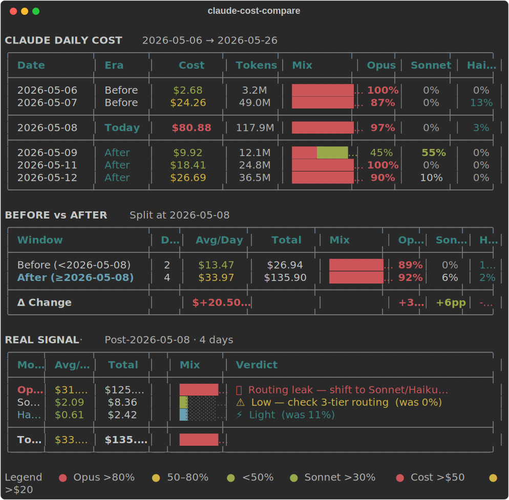
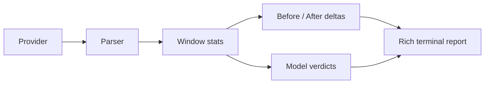

<div align="center">

# ai-cost-compare

**Daily AI spend (Claude Code, Cursor), before/after windows, and model routing health — in your terminal.**

[](https://pypi.org/project/ai-cost-compare/)
[](https://pypi.org/project/ai-cost-compare/)
[](https://github.com/mazulo/ai-cost-compare/actions/workflows/ci.yml)
[](LICENSE)

Turn local usage data into three Rich tables: daily cost, split-window comparison, and per-model verdicts. **Claude** via [ccusage](https://github.com/ryoppippi/ccusage); **Cursor** via dashboard CSV (or optional API token).

**Not a ccusage fork** — an interpretation layer on top. ccusage reports what you spent; this CLI adds before/after windows, mix shifts, and routing health verdicts.

[Quick start](#-quick-start) · [Demo](#-demo) · [ccusage vs this tool](#-ccusage-vs-this-tool) · [Install](#-install) · [Usage](#-usage) · [How it works](#-how-it-works)

</div>

---

## ✨ Why this exists

Claude Code usage can spike fast — especially when Opus routing leaks or Sonnet/Haiku tiers stop doing their job. This CLI answers three questions at a glance:

| Question | Table |
|----------|-------|
| What did I spend each day? | **Daily cost** — cost, tokens, model mix |
| Did things change after a date? | **Before vs After** — avg/day, totals, mix shift |
| Are models routed correctly? | **Real Signal** — Opus / Sonnet / Haiku verdicts |

No cloud upload. Reads your local ccusage JSON and prints a terminal report.

---

## 🔀 ccusage vs this tool

| | [ccusage](https://github.com/ryoppippi/ccusage) | **ai-cost-compare** |
|---|-----|-----|
| **Role** | Usage analytics — read local logs, report spend | Interpretation layer — explain *what changed* and *if routing looks healthy* |
| **Scope** | Many agents, daily/weekly/monthly/session views | Claude Code focus: before/after split + model mix verdicts |
| **Output** | Descriptive tables & totals | Daily cost + **Before vs After** + **Real Signal** (Opus/Sonnet/Haiku) |
| **Install both?** | ✅ Required (data source) | ✅ Optional companion on top |

Use ccusage for *“what did I spend?”* Use this when *“did something break after I changed config on Tuesday?”*

---

## 🖥 Demo

<p align="center">
  
</p>

<p align="center">
  <sub>Sample fixture output · <code>--range 7 --cutoff 2026-05-08</code></sub>
</p>

<details>
<summary><strong>Same output as plain text</strong></summary>

```bash
ai-cost-compare --range 7 --cutoff 2026-05-08
```

```
CLAUDE DAILY COST  ·  2026-05-06 → 2026-05-08
┌─────────────┬────────┬───────────┬────────┬───────────┬──────┬────────┬──────┐
│ Date        │ Era    │      Cost │ Tokens │ Mix       │ Opus │ Sonnet │ Haiku│
├─────────────┼────────┼───────────┼────────┼───────────┼──────┼────────┼──────┤
│ 2026-05-06  │ Before │     $2.68 │   3.2M │ ████████… │ 100% │     0% │   0% │
│ 2026-05-07  │ Before │    $24.26 │  49.0M │ ████████… │  87% │     0% │  13% │
│ 2026-05-08  │ Today  │    $80.88 │ 117.9M │ ████████… │  97% │     0% │   3% │
└─────────────┴────────┴───────────┴────────┴───────────┴──────┴────────┴──────┘

BEFORE vs AFTER  ·  Split at 2026-05-08
REAL SIGNAL      ·  Post-2026-05-08 · per-model routing verdicts
```

</details>

---

## 🚀 Quick start

**1. Install ccusage** (peer dependency — reads your local usage data):

```bash
npm install -g ccusage
```

**2. Install the CLI:**

```bash
pip install ai-cost-compare
# or
uv tool install ai-cost-compare
```

**3. Run:**

```bash
ai-cost-compare --range 5
```

---

## 📦 Install

### PyPI / uv

```bash
pip install ai-cost-compare
uv tool install ai-cost-compare
uvx ai-cost-compare --help          # run without installing
```

### Homebrew

```bash
brew tap mazulo/ai-cost-compare https://github.com/mazulo/ai-cost-compare
brew install ai-cost-compare
npm install -g ccusage                  # still required
```

One-liner (no tap):

```bash
brew install https://raw.githubusercontent.com/mazulo/ai-cost-compare/main/Formula/ai-cost-compare.rb
```

### Requirements

- Python **3.11+** (pip/uv) or Homebrew
- [ccusage](https://www.npmjs.com/package/ccusage) on your `PATH` (v18+; v20 `period` JSON field supported)

---

## 📖 Usage

### Claude Code (default)

`ai-cost-compare` and `ai-cost-compare claude` are equivalent. Legacy installs: `claude-cost-compare` / `cccompare` still work.

```bash
# Last 5 days vs today (default)
ai-cost-compare --range 5

# 7-day window split at a specific date
ai-cost-compare claude --range 7 --cutoff 2026-05-13

# Daily summary only — skip comparison tables
ai-cost-compare --summary --since 2026-05-01
```

Requires [ccusage](https://www.npmjs.com/package/ccusage) on your `PATH`.

### Cursor IDE

**Option A — CSV export:**

1. Go to [cursor.com/dashboard/usage](https://cursor.com/dashboard/usage) and export a CSV
2. Run:

```bash
ai-cost-compare cursor --file ~/Downloads/usage.csv --range 7 --cutoff 2026-05-13
```

**Option B — session token (auto-fetch):**

1. Install the API extra: `pip install 'ai-cost-compare[cursor-api]'`
2. Open any [cursor.com](https://cursor.com) page while logged in
3. Open browser DevTools → **Application** → **Cookies** → `cursor.com`
4. Copy the value of `WorkosCursorSessionToken`
5. Add it to `~/.config/ai-cost-compare/config.toml` (created automatically on first run):

```toml
[cursor]
session_token = "paste-your-token-here"
```

6. Run:

```bash
ai-cost-compare cursor --range 5
```

The config file is created with instructions the first time you run `ai-cost-compare cursor`.

### Shared flags

| Flag | Short | Description |
|------|-------|-------------|
| `--range` | `-r` | Days before cutoff for the "before" window (default: `5`) |
| `--cutoff` | `-c` | Before/after split date `YYYY-MM-DD` (default: today) |
| `--since` | `-s` | Explicit start date — overrides `--range` |
| `--summary` | | Daily cost table only |
| `--plain` | | Disable color |
| `--file` | `-f` | Cursor only: path to exported CSV |
| `--cursor-token` | | Cursor only: session token (overrides config) |

---

## 🧠 How it works



1. **Provider** — `claude` (ccusage JSON) or `cursor` (CSV / optional API).
2. **Parse** — normalizes dates, costs, and per-model buckets (provider taxonomy).
3. **Analyze** — splits records at `--cutoff`, computes averages and mix shifts.
4. **Verdict** — provider-specific routing health rules.
5. **Render** — Rich tables with era labels, mix bars, and color-coded costs.

---

## 🛠 Development

```bash
git clone https://github.com/mazulo/ai-cost-compare.git
cd ai-cost-compare
uv sync --dev
uv run pytest
uv run ai-cost-compare --range 5
```

Regenerate the README demo SVG after UI changes:

```bash
uv run python scripts/export_demo.py
```

---

## 🚢 Releasing

Bump `version` in `pyproject.toml` and `src/ai_cost_compare/__init__.py`, push to `main`, then run the **Publish** workflow from GitHub Actions. It will:

1. Run tests and publish to PyPI
2. Update the Homebrew formula checksum
3. Create a git tag and GitHub Release
4. Refresh Homebrew Python resources on macOS

Details: [docs/RELEASING.md](docs/RELEASING.md)

---

## 📄 License

MIT — see [LICENSE](LICENSE).

---

<div align="center">

Built for developers who want spend visibility across Claude Code and Cursor without leaving the terminal.

**[⭐ Star on GitHub](https://github.com/mazulo/ai-cost-compare)** if this saves you from an Opus routing surprise.

</div>
